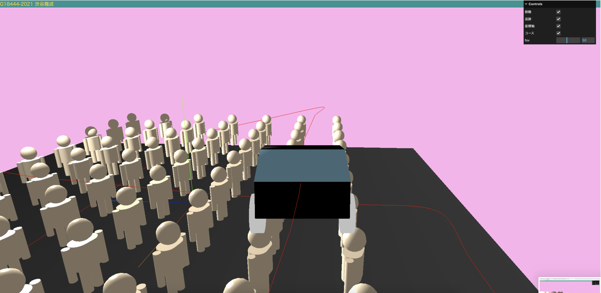

# タイトル
人間の間を通るそらとぶ車
応用プログラミングレポート @G184442021 渋谷　龍成

## 作品の概要
下のスクリーンショットのようなそらとぶ車が人間の間を通るようなシーンを作成した。コントロールで視野角、俯瞰、カメラの追跡、コース、座標軸、を設定してそれらの値を変えたり、チェックボックスの有無によってシーンの見え方を変えた。


## 代表的な変数の説明

* `car` ：`car`では大きな変数として扱い（グループ）その中に車のボディや窓、タイヤ、屋根といった変数を追加し`car`の値を変更することによって車全体の高さや大きさを変えることに成功した。

* `param` ：この変数は視野角、俯瞰、カメラの追跡、コース、座標軸をコントロールとして追加する上でないといけない存在である。`follow`（カメラの追跡）`birdsEye`（俯瞰）`course`（コース）`axes`（座標軸）である。ここをtrue,falseにするかで最初のシーンの見え方が変わる。

* `controlPoints` ：この変数はこのシーンを表示する上で要といっても間違いない。単刀直入に言うとこの変数は車が人間に当たらないようにしてくれるものである。ここの変数の初期値を設定することにより車が空中浮遊してくれるのと同時にコースを自由自在につくることができる。

## 工夫(苦心)したところ

* ここでは作成した人間を10☓7で配置することをした。`seats`を大きなグループとしてここに作成してクローンした人間を入れた。`seats`を大きな変数として扱っているおかげで、最終的に人間全体を動かしたい時に`seats`の変数一つで変わるのでそこが工夫点でもある。10☓7で人間を配置することには成功したが、ランダムに配置することができなかったのが苦心点である。コメントになっているのはそのためである。
```javascript
////人間を配置する
const seats = new THREE.Group();{
for (let r = 0; r < model.nRow; r += 1 ){
  for( let c = 0; c < model.nCol; c +=1 ) {
    //if(Math.random() < 0.4) {
      const junin = metalRobot.clone();
      junin.position.set(
        (model.w + model.gapX) * (c - (model.nCol-1)/2),
        r * model.gapY - 2+0.8,
        (model.d + model.gapZ) * r + 5
      );
     
      seats.add(junin);
    //}
  }
 }
 seats.position.z = -30; //ロボット全体を動かして位置調整
}
scene.add(seats);
```
* ここでは制御変数として`controlPoints`を設定してここの初期値を色々いじって変えることにより、車が人間に当たらないように工夫した。さらには空中浮遊させたかったのでここの値を変えたのも工夫である。

```javascript
// 自動操縦コースの設定
  // 制御点(ここの初期値を調整をして、車が人間に当たらないようにした。)
  const controlPoints = [
    [0, 2, 0],
    [0, 5, 40],   
    [50, 5, 40],
    [50, -1, 0],    
    [50, 20, -20],  
    [-40, 10, -20], 
    [-48, 0, 18],
    [40, -1, 18],
    [44, 1, -40],
    [0, 0, -40],
```
[0, 2, 0]のそれぞれの値を変更することによって車が中に浮いたり縦横の移動の幅を変えることができた。

* ここでは人間の動きを変えることをした。大きな変数としてseetsとして、そのchildrenをjuninとした。まずこのjuninを動かしたいので` junin.position.y`で人間をその場で回転させるようにした。そして0.1の部分では回転する速度が変わるので色々な数値を設定した結果0.1一番丁度いい回転速度になった。
```javascript
//人間の動き
      seats.children.forEach((junin)=>{  //seatsグループかjuninを持ってきてjuninを回転させる処理をした。
        junin.rotation.y
        = ( junin.rotation.y + 0.1) % (2 * Math.PI); //junin.rotation.y + 0.1の0.1の値を大きくするほど回転速度が上がる
        junin.position.y= Math.sin(junin.rotation.y);
      });
```

## 感想
今回の制作では関数の呼び出しやオブジェクトに対する理解の深みが更に深まったいい機会になったと思いました。プログラミング1，2で学んだことがすべて応用として使われていたので復習になりました。アルゴリズムの授業でも、大きなプログラムはプログラムをいくつかの小さな部分に分割して作成されることが多いと書いてありましたがまさにそのとおりだなと思いました。関数や変数一つ一つがそれぞれの役割を持っていて、それが積み重なってひとつの大きなプログラムになっているのだなと実感しました。